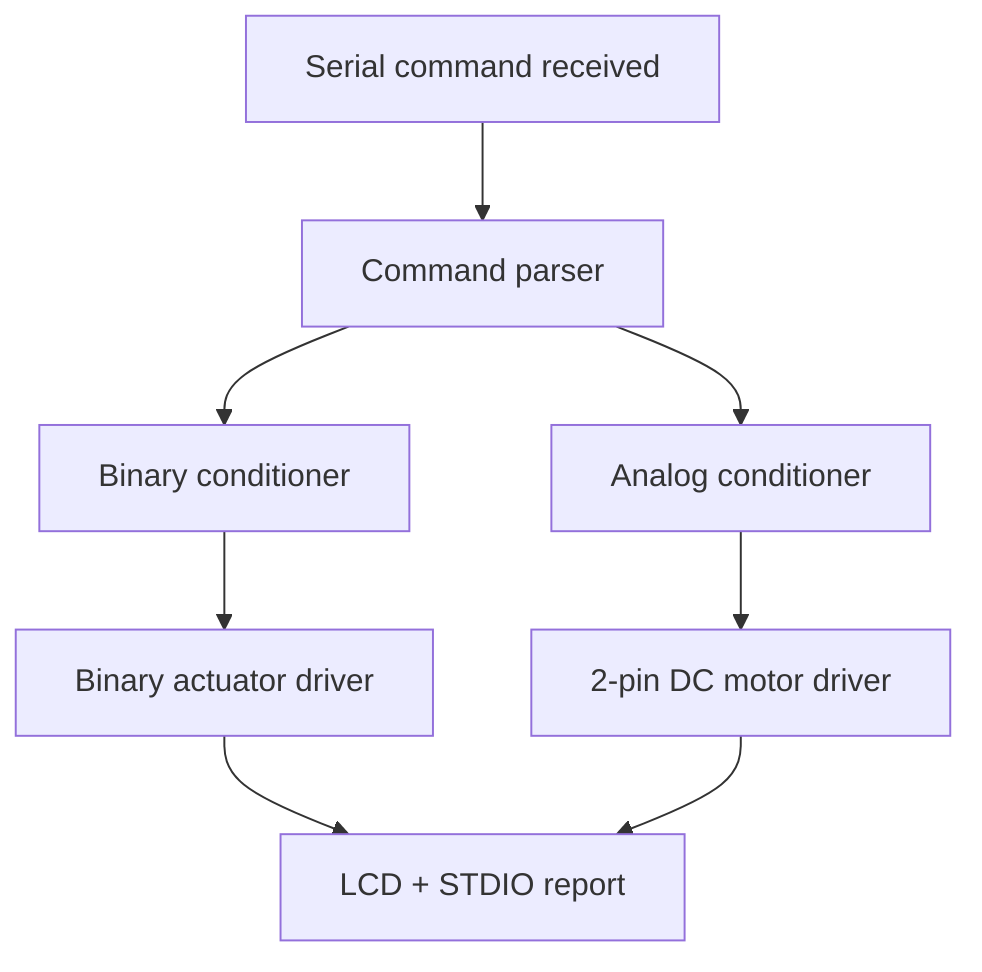
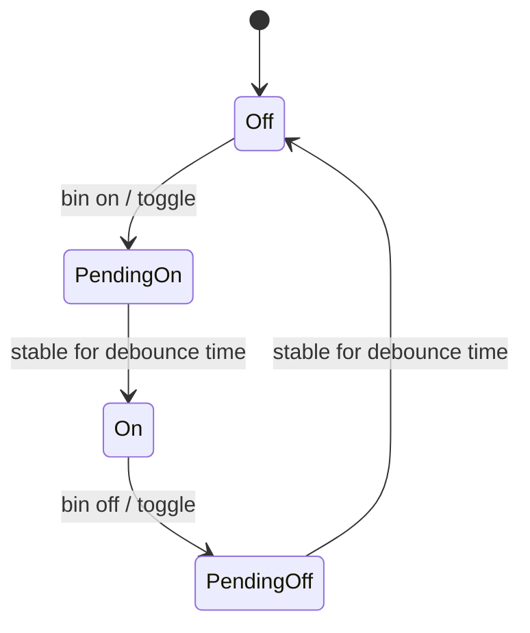

# Lab 7 - Actuator Control with STDIO, LCD, Wokwi, and PlatformIO

## Goal

This lab implements a modular actuator control application for **Arduino Uno** using:
- a **binary actuator** represented by a digital indicator LED
- an **analog actuator** based on a **2-pin DC motor** driven through an **L293D H-bridge**
- **STDIO over Serial** for command input and structured reporting
- a **16x2 LCD** for live status display
- **Wokwi** for simulation and **PlatformIO** for build/run

Everything is written in English and the actuator logic is split into dedicated software drivers/modules.

## Implemented Requirements

- User commands arrive through **serial STDIO**.
- Binary control accepts `ON`, `OFF`, and `TOGGLE` requests.
- Binary requests are conditioned with **software debouncing** and stable-state validation.
- Analog control accepts a signed target percentage from `-100` to `100`.
- Analog commands use **saturation**, **low-pass filtering**, and **soft ramping**. Negative values reverse the DC motor direction.
- The LCD shows the current actuator state and active alerts.
- Serial reporting runs periodically every `500 ms`.
- Response latency stays below `100 ms` because control logic runs every `20 ms`.

## Command Interface

Open the serial monitor at `115200` baud and send one of these commands:

```text
help
status
bin on
bin off
bin toggle
ana <-100..100>
report on
report off
```

Examples:

```text
bin on
ana 65
status
```

In Wokwi, use the built-in **Serial Monitor** for both command input and `printf` output.

## Software Architecture

- `src/app/ActuatorLabApp.*` - main application scheduler and command parser
- `src/actuators/BinaryActuator.*` - binary actuator driver
- `src/actuators/L293dDcMotorActuator.*` - L293D-based DC motor driver
- `src/signal/BinaryCommandConditioner.*` - debounce and stable-state validation
- `src/signal/AnalogCommandConditioner.*` - saturation, filtering, and ramping
- `src/io/StdioBridge.*` - `printf` output bridge for Serial
- `src/io/CommandInterface.*` - non-blocking serial line reader
- `src/io/LcdDisplay.*` - LCD driver for live status pages
- `src/config/AppConfig.h` - all pins and timing constants
- `src/main.cpp` - wiring and application entry point

## Control Flow Diagram



## Binary Actuator State Diagram



## Hardware Mapping

### LCD 16x2
- `RS -> D7`
- `E  -> D6`
- `D4 -> D5`
- `D5 -> D4`
- `D6 -> D3`
- `D7 -> D13`

### Actuators
- Binary actuator LED -> `D12`
- L293D `IN1` -> `D8`
- L293D `IN2` -> `D9`
- L293D `EN1,2` (PWM) -> `D10`
- L293D `OUT1/OUT2` -> DC motor terminals

### Wokwi Terminal
- Use the built-in Wokwi Serial Monitor
- It opens in `terminal` mode automatically
- Press Enter after each command
- The parser accepts both `CR` and `LF`, and supports backspace/delete

## Notes About the Simulation

- The **yellow LED** is the binary actuator indicator.
- The analog channel uses a **2-pin DC motor** model in Wokwi.
- The motor direction is controlled by L293D `IN1/IN2`, while speed is controlled by PWM on `EN1,2`.
- Alerts are shown on the LCD and in `printf` status output.

## Build and Run

```bash
cd lab7
pio run
pio device monitor -b 115200
```

For Wokwi, open the `lab7` folder in VS Code with the Wokwi extension and run the simulation.

## Example Validation Scenario

1. Type `bin on` -> the binary actuator LED turns on after debounce validation.
2. Type `bin off` or `bin toggle` -> the binary actuator changes state.
3. Type `ana 30` or `ana 80` -> the stepper speed ramps smoothly to the requested level.
4. Watch the `printf` messages in the Wokwi terminal and the state pages on the LCD.
